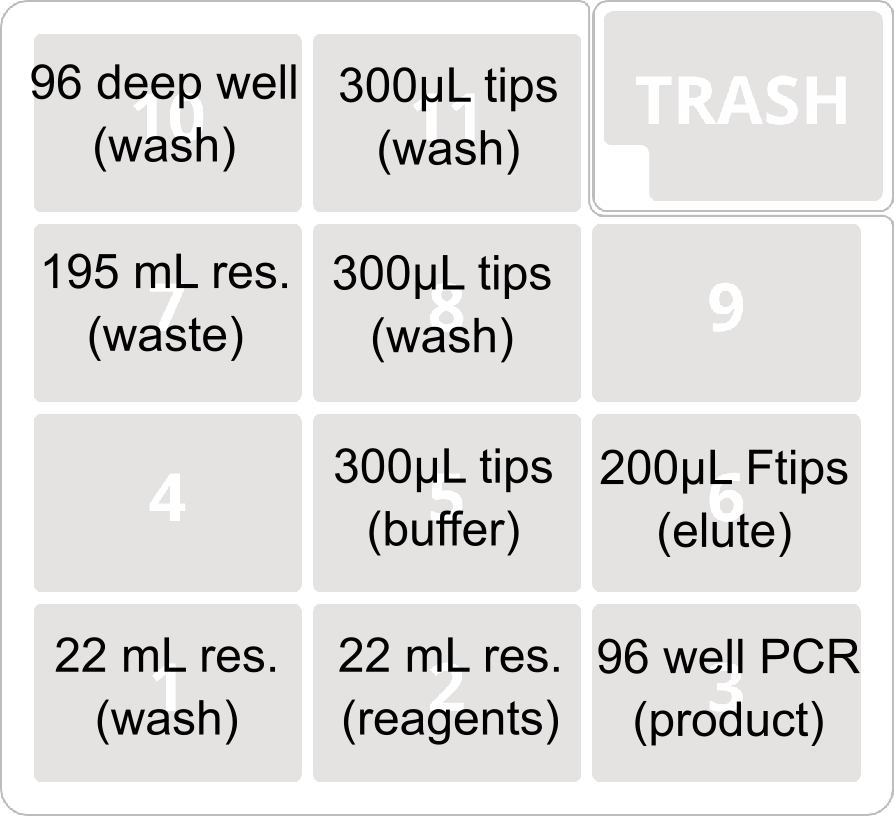

# Zymo QuickDNA Fecal/Soil DNA Extraction

This protocol automates the hybrid tube/plate version of the magbead extraction protocol. 

The protocol is divided into two parts: Part A condenses the homogenates from tube to plate format, and Part B performs the DNA isolation using magnetic beads. 

# Part A

## Buffers and Reagents

### Longmire lysis solution

600 µL per sample.

### Proteinase K, 40 mg/mL

12 µL per sample.

### 3X Protein precipitation solution

240 mM aluminium ammonium sulphate dodecahydrate.

100 µL per sample.

### Inhibitor flocculation solution

400 mM ammonium acetate.

100 µL per sample.

## Equipment
### OpenTrons equipment

- OT-2 robot
- Single channel P300 pipette
- 4x OpenTrons 24-place tube racks

## Consumables

- 1x Opentrons 200 µL filtertips

## Setup

### Deck layout

## Protocol

- Add 600 uL of Longmire lysis solution and 12 ul of 40 mg/ml proteinase K to a 2 ml tube with eDNA filter. 
- Incubate at 56 C for three hours (can incubate overnight). 
- Transfer the lysate into new 2 ml tube
- Add 100 uL of 3X protein precipitation solution 
- Vortex for 10 sec 
- Add 100 ul of inhibitor flocculation solution 
- Vortex for 10 sec 
- Incubate in the freezer for 25 mins 
- Centrifuge at 10,000x for 3 min 

Place uncapped tubes into the four 24-place OpenTrons tube racks. They will be transferred to the deep-well plate in the same orientation presented on the deck. In other words, samples from deck slot 4 will end up in the top-left quadrant of the plate, samples from deck slot 5 will end up in the bottom-right quadrant, and so on. 

# Part B

## Buffers and Reagents

### SeraMag beads

Prepare 12 ml of 20% SeraMag beads using 2.5x Environmental hybrization buffer. Wash 4mL GE Carboxyl Modified Seramag Speed Beads twice with 1mL of TE. Remove SUP, then add 7.125 mL 2.5x eDNA Hybridization Buffer and 10.125 mL TE. 

12 mL per plate

### Hybridization Buffer

2.5X Environmental hybrization buffer (For 500mL: 1g DTT, 72.5g NaCl, 125g PEG 8000, 500μL 0.5M EDTA, HPLC water up to 500mL (mix vigorously, Store at 4°C. Wrap in foil if exposed to light))

60 mL per plate

### EtOH wash

80% EtOH. 200 mL per plate.

### Elution Buffer

12 mL per plate.

## Equipment
### OpenTrons equipment

- OT-2 robot
- 8-channel P300 pipette gen2
- Magnetic module gen2

### Other equipment

- Plate rotator
- Seal for deep-well plate

## Consumables

- 1x 96-well 2 mL u-bottom plate (output of Part A)
- 2x USA Scientific 22 mL reservoir plate
- 1x NEST 195 mL reservoir plate
- 1x BioRad 96 well 200 µL PCR plate
- 3x Opentrons 300 µL tips
- 1x Opentrons 200 µL filter tips

## Setup

### Deck layout

### Reagents

- 9: Reagents (USA Scientific 22 mL reservoir plate)
	- 1: SeraMag Beads (12 mL)
	- 2-5: 2.5X hyb buffer (18 mL/well)
	- 8: Elution Buffer (12 mL)
- 11: Wash buffers (USA Scientific 22 mL reservoir plate)
	- 1-10: 80% EtOH Buffer 1 (20 mL/well)

## Protocol

Place plate of homogenate supernatants (output of Part A) onto the magdeck in position 10. Press go. 

Once the robot has transferred beads and hybridization solution to the deep-well plate, it will pause the protocol. Remove the plate, seal it, and place it on the rotator for ten minutes. Then, remove the seal and place back on the magnetic module. The remainder of the protocol is automated.
